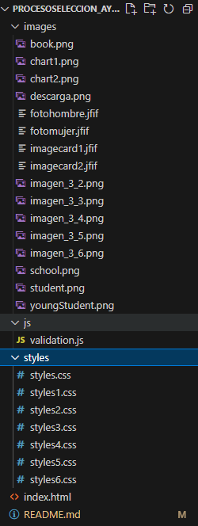

# ProcesoSeleccion_AyudaTPymes
-- Descripción:
    Este proyecto se ha realizado para el proceso de selección de la empresa AyudaTPymes. La web está diseñada con HTML y CSS, y utiliza JavaScript para la validación del correo electrónico.

-- Tecnologías Utilizadas:
    HTML: Estructura básica de la página web.
    CSS: Estilos y animaciones.
    JavaScript: Validación de formulario y funcionalidad interactiva.

-- Librerías Utilizadas:
    Bootstrap: Para el diseño responsivo y el sistema de grid.
    Google Fonts: Para la fuente Montserrat.
    Bootstrap Icons: Para los iconos de redes sociales y otros elementos visuales.

-- Estructura del Proyecto:

-- Instrucciones para Desplegar Localmente:

1º- Abre tu terminal y clona el repositorio:

    git clone https://github.com/Ajuan0824/ProcesoSeleccion_AyudaTPymes.git

2º- Navega al Directorio del Proyecto

    cd ProcesoSeleccion_AyudaTPymes

3º- Abre el Archivo HTML en tu Navegador

    Puedes abrir el archivo index.html directamente en tu navegador. Si usas VSCode, puedes usar la extensión "Live Server" para lanzar el servidor local.

Si por casualidad no funciona, dejo por aquí el siguiente enlace con la web subida: 

https://ajuan0824.github.io/ProcesoSeleccion_AyudaTPymes/
